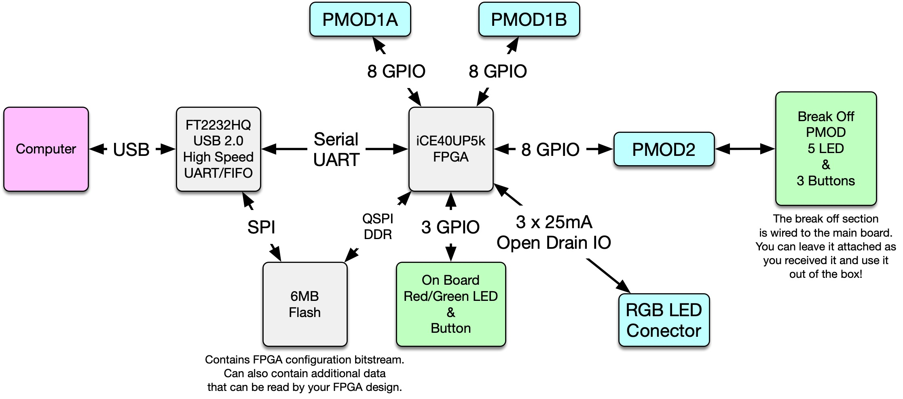
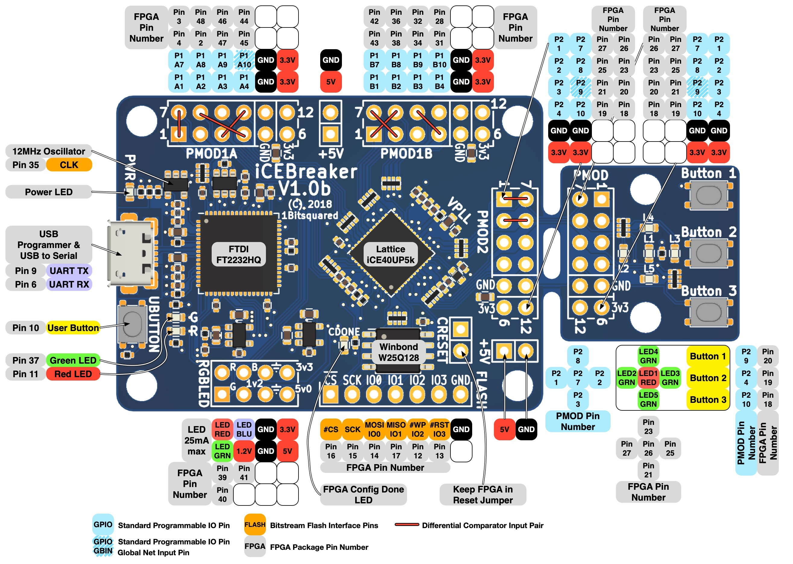

# Agentic Verilog for iCE40 iCEBreaker

Using Claude Code to generate Verilog HDL for the iCEBreaker FPGA development board featuring the Lattice iCE40 UP5K.

## Overview

This repository demonstrates an agentic approach to FPGA development where Claude Code assists in generating, reviewing, and iterating on Verilog designs targeting the iCEBreaker board. Each example is heavily commented to explain Verilog concepts and how hardware description differs from software programming.

## Hardware

### iCEBreaker Board

The [iCEBreaker](https://1bitsquared.com/products/icebreaker) is an open-source FPGA development board designed for learning and prototyping. The official repository with schematics, examples, and documentation is available at [github.com/icebreaker-fpga/icebreaker](https://github.com/icebreaker-fpga/icebreaker).

Reference materials included in `docs/`:
- <a href="docs/icebreaker-v1.1a-sch.pdf" target="_blank">icebreaker-v1.1a-sch.pdf</a> - Full board schematic
- <a href="docs/icebreaker-v1_0b-legend-jumpers.jpg" target="_blank">icebreaker-v1_0b-legend-jumpers.jpg</a> - Jumper configuration guide

### Block Diagram

<a href="docs/icebreaker-block-diagram.jpg" target="_blank">
  
</a>

### Board Pin Legend

<a href="docs/icebreaker-v1_0b-legend.jpg" target="_blank">
  
</a>

*Note: We are using the iCEBreaker v1.1A board. The pin legend above is from v1.0b, but the pinout is expected to be the same.*

### Features

- Lattice iCE40 UP5K FPGA
- USB programming via FTDI FT2232H
- PMOD connectors for expansion
- RGB LED and user buttons
- Open-source toolchain support

### Lattice iCE40 UP5K FPGA

The iCE40 UltraPlus 5K is a low-power FPGA well-suited for edge applications:

- 5,280 logic cells
- 1 Mbit SPRAM (Single-Port RAM)
- 120 Kbit DPRAM (Dual-Port RAM)
- 8 multiplier blocks (16x16)
- 1 PLL, 2 I2C, 2 SPI hard IP blocks
- Up to 39 GPIO pins
- Ultra-low power operation (as low as 75 uA in standby)

### PMOD Modules

#### PMOD AD1 - Two-Channel 12-bit ADC

The <a href="https://digilent.com/reference/pmod/pmodad1/reference-manual" target="_blank">PMOD AD1</a> features two Analog Devices AD7476A 12-bit ADCs with a 1 MSPS sampling rate. It uses an SPI interface and is ideal for analog signal acquisition.

Reference materials in `docs/`:
- <a href="docs/pmodad1_sch.pdf" target="_blank">pmodad1_sch.pdf</a> - PMOD AD1 schematic
- <a href="docs/ad7476a.pdf" target="_blank">ad7476a.pdf</a> - AD7476A ADC datasheet

#### PMOD DA2 - Two-Channel 12-bit DAC

The <a href="https://digilent.com/reference/pmod/pmodda2/reference-manual" target="_blank">PMOD DA2</a> features two Texas Instruments DAC121S101 12-bit DACs with an SPI interface. It provides dual analog outputs for signal generation applications.

Reference materials in `docs/`:
- <a href="docs/pmodda2_sch.pdf" target="_blank">pmodda2_sch.pdf</a> - PMOD DA2 schematic
- <a href="docs/dac121s101.pdf" target="_blank">dac121s101.pdf</a> - DAC121S101 DAC datasheet

## Project Structure

```
.
├── src/
│   ├── blinky/          # Basic LED blinker
│   ├── blinky-switches/ # Variable speed blinker with switch control
│   ├── pwm-breathe/     # Smooth LED breathing effect using PWM
│   ├── led-chaser/      # Knight Rider running lights effect
│   ├── uart-tx/         # UART transmitter - sends "Hello" to PC
│   ├── uart-rx/         # UART receiver - LED control from keyboard
│   ├── uart-echo/       # UART echo with case toggle
│   ├── freq-counter/    # Frequency counter with selectable generator
│   ├── dac-ramp/        # DAC triangle wave generator with PLL
│   ├── adc-read/        # ADC reader with UART output
│   ├── dac-adc-loopback/ # DAC-ADC loopback with modular design
│   └── adc-read-i2c/    # I2C ADC reader with ADS1115
├── docs/                # Component datasheets and reference materials
│   ├── ad7476a.pdf             # AD7476A 12-bit ADC datasheet
│   ├── ads1115.pdf             # ADS1115 16-bit ADC datasheet
│   ├── dac121s101.pdf          # DAC121S101 12-bit DAC datasheet
│   ├── iCE40-UltraPlus-Family-Data-Sheet.pdf
│   ├── icebreaker-v1.1a-sch.pdf        # iCEBreaker schematic
│   ├── icebreaker-block-diagram.jpg    # iCEBreaker block diagram
│   ├── icebreaker-v1_0b-legend.jpg     # Board pin legend
│   ├── icebreaker-v1_0b-legend-jumpers.jpg  # Jumper configuration
│   ├── pmodad1_sch.pdf         # PMOD AD1 schematic
│   ├── pmodda2_sch.pdf         # PMOD DA2 schematic
│   ├── SBTICETechnologyLibrary201701.pdf  # iCE40 primitive reference
│   └── SBTICE_Technology_Library_Index.md # Primitive index
├── LICENSE
├── README.md
└── TODO.md            # Future project roadmap
```

## Examples

### Blinky
A simple LED blinker - the "Hello World" of FPGA development. Demonstrates:
- Module declaration and ports
- 24-bit counter register
- Sequential logic with `always @(posedge clk)`
- Combinational logic with `assign`
- Clock division to create visible blinking (~2.86 Hz)

### Blinky-switches
Extends the blinker with switch inputs to control blink speed. Demonstrates:
- Multiple input ports
- Conditional logic with `if/else`
- Different counter bit selection for varying frequencies
- Switch debouncing concepts

### PWM-breathe
Creates a smooth breathing/pulsing LED effect using Pulse Width Modulation. Demonstrates:
- PWM fundamentals (duty cycle control)
- Multi-counter designs
- State machines (direction flag)
- Perceived brightness vs. actual on/off switching

### LED-chaser
A "Knight Rider" running light effect using the 5 breakout board LEDs. Demonstrates:
- Multi-bit outputs (controlling multiple LEDs)
- Position tracking with a counter
- Direction flag for bidirectional movement
- Boundary detection and reversal
- Decoder logic (binary to one-hot conversion)

### UART-TX
Transmits "Hello from iCEBreaker!" to your PC every second over the built-in USB serial port. Demonstrates:
- UART protocol (start bit, 8 data bits LSB-first, stop bit)
- Baud rate generation (115200 bps from 12 MHz clock)
- State machines for serial protocol handling
- ROM initialization for storing message strings
- Bit shifting for serial output

**Testing:** `make prog`, then `screen /dev/ttyUSB1 115200`

### UART-RX
Receives keyboard input from PC and controls the accent LED. Type '1' to turn LED on, '0' to turn it off. Demonstrates:
- Asynchronous input synchronization (metastability prevention)
- Start bit detection (falling edge)
- Middle-of-bit sampling strategy for reliability
- Shift registers for assembling received bytes
- ASCII character comparison

**Testing:** `make prog`, then `screen /dev/ttyUSB1 115200`, type '1' or '0'

### UART-Echo
Echoes received characters back with case toggled (lowercase becomes uppercase and vice versa). Demonstrates:
- Combined RX and TX in a single module
- ASCII manipulation (XOR with 0x20 toggles case for letters)
- Character range detection (checking if byte is a letter)
- Chaining RX completion to TX start

**Testing:** `make prog`, then `screen /dev/ttyUSB1 115200`, type letters

### Freq-Counter
A frequency counter with a selectable frequency generator. The generator outputs on PMOD 1A pin 1, and the counter measures the signal on PMOD 1A pin 7. Connect them with a jumper for loopback testing. Demonstrates:
- Clock dividers for frequency generation (500 kHz, 1 MHz, 2 MHz)
- Reciprocal frequency counting (count edges over 1-second gate time)
- Binary to decimal ASCII conversion for UART output
- Input synchronization for external signals
- Button input for frequency selection

**Maximum measurable frequency:** ~3 MHz (limited by 12 MHz clock and edge detection)

**Testing:** Connect PMOD 1A pin 1 to pin 7 with a jumper, `make prog`, then `screen /dev/ttyUSB1 115200`. Press buttons to change generator frequency.

### DAC-Ramp
Generates a triangular ramp waveform on the PMOD DA2 (DAC121S101) output. The voltage ramps smoothly from 0V to 3.3V and back at ~200 Hz. Demonstrates:
- PLL instantiation (SB_PLL40_PAD) to generate 60 MHz from 12 MHz input
- SPI master interface at 30 MHz (DAC121S101 maximum speed)
- DAC121S101 16-bit word protocol
- State machine for SPI control
- Triangle wave generation with direction flag

**Testing:** Connect PMOD DA2 to PMOD1A, `make prog`, view output on oscilloscope (J2 pins 1-2 for channel A).

### ADC-Read
Reads analog values from the PMOD AD1 (AD7476A) and displays them via UART. Samples the ADC 10 times per second and sends hex-formatted readings to the PC. Demonstrates:
- SPI master interface for reading (vs. writing in DAC project)
- AD7476A 12-bit ADC protocol (data clocked out on falling SCLK edges)
- Binary to hex ASCII conversion
- State machine handshaking between ADC and UART controllers
- UART transmission at 115200 baud

**Testing:** Connect PMOD AD1 to PMOD1B, `make prog`, then `screen /dev/ttyUSB1 115200`. Apply 0-3.3V signal to A0 input.

### DAC-ADC-Loopback
Generates a slow triangle wave on the DAC and reads it back via the ADC, demonstrating both analog output and input with UART monitoring. This project showcases **modular Verilog design** with separate reusable components. Demonstrates:
- Modular design with separate files for SPI DAC, SPI ADC, UART TX, and triangle generator
- Module instantiation and parameterization
- Reusable components that can be copied to other projects
- Analog loopback testing (verifying DAC output with ADC input)
- Combined SPI write (DAC) and SPI read (ADC) in one project

**Testing:** Connect PMOD DA2 to PMOD1A, PMOD AD1 to PMOD1B, wire DAC output to ADC input, `make prog`, then `screen /dev/ttyUSB1 115200`. Watch ADC readings track the 60-second triangle wave.

### ADC-Read-I2C
Reads analog values from an ADS1115 16-bit I2C ADC and displays them via UART. This project implements a complete I2C master in pure Verilog (soft implementation) without using the iCE40's hard I2C IP. Demonstrates:
- I2C master with START/STOP conditions, ACK/NACK handling
- Open-drain emulation using SB_IO tristate primitives
- Bidirectional signals (`inout` ports)
- Multi-byte transactions with register addressing
- Timeout detection for stuck bus conditions
- Binary to hex ASCII conversion for UART output

**Testing:** Connect ADS1115 breakout to PMOD1A (SCL=pin 45, SDA=pin 47), `make prog`, then `screen /dev/ttyUSB1 115200`. Apply 0-3.3V signal to A0 input.

## Using Claude Code for Verilog Generation

### Workflow

1. **Describe your design requirements** - Tell Claude Code what you want to build (e.g., "Create an SPI controller to interface with the AD7476A ADC")

2. **Reference datasheets** - Point Claude Code to the relevant datasheets in the `docs/` directory for timing diagrams, register maps, and protocol specifications

3. **Iterate on the design** - Review generated Verilog, request modifications, and refine the implementation

4. **Simulate and test** - Use the open-source toolchain to simulate and verify the design

5. **Synthesize and program** - Build the bitstream and program the iCEBreaker

### Example Prompts

```
Generate a Verilog module for an SPI master that can read from the AD7476A ADC.
Use the timing specifications from docs/ad7476a.pdf.
```

```
Create a PWM controller with configurable duty cycle for driving an LED,
targeting 1kHz at the 12MHz iCEBreaker clock.
```

```
Review this Verilog module for timing issues and suggest improvements
for the iCE40 UP5K target.
```

### Best Practices

- **Provide context** - Share relevant datasheets and constraints with Claude Code
- **Be specific** - Include clock frequencies, interface requirements, and target specifications
- **Iterate** - Start with a basic implementation and refine it through conversation
- **Verify** - Always simulate designs before programming the FPGA
- **Review timing** - Ask Claude Code to check for clock domain crossings and timing issues

## Toolchain

This project uses the open-source FPGA toolchain:

- **Yosys** - Verilog synthesis
- **nextpnr-ice40** - Place and route
- **icepack** - Bitstream generation
- **iceprog** - FPGA programming

### Installation (Ubuntu/Debian)

```bash
sudo apt install fpga-icestorm yosys nextpnr-ice40
```

### Installation (macOS)

```bash
brew install icestorm yosys nextpnr
```

### Building Examples

```bash
cd src/<example-directory>
make        # Build the bitstream (outputs to /tmp)
make prog   # Program the FPGA
make clean  # Remove build artifacts from /tmp
```

Build artifacts (`.json`, `.asc`, `.bin`) are generated in `/tmp` to keep source directories clean.

## External Resources

- <a href="https://github.com/icebreaker-fpga/icebreaker" target="_blank">iCEBreaker Hardware</a> - Board design files and documentation
- <a href="https://github.com/icebreaker-fpga/icebreaker-verilog-examples" target="_blank">iCEBreaker Verilog Examples</a> - Official collection of example Verilog projects

## License

MIT License - See [LICENSE](LICENSE) for details.
