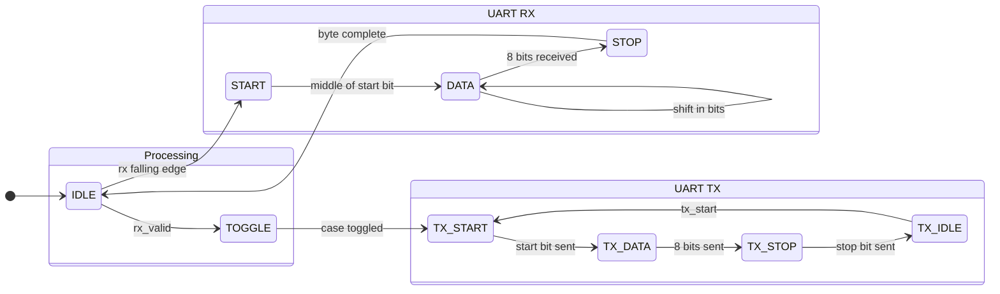

# FPGA Video Series - Future Topics

A roadmap for additional agentic Verilog tutorials, organized by priority and complexity.

**Target Hardware**: iCEBreaker v1.0b/v1.1a with Lattice iCE40 UP5K
- Note: Unlike boards like the Nandland Go Board, iCEBreaker does NOT have built-in 7-segment displays or multiple user buttons. It has minimal onboard I/O (1 button, 2 LEDs) - most I/O comes via PMODs.

---

## Your Proposed Topics

### 1. I2C for ADS1115 Breakout Board (Soft Implementation)

**Concept**: Implement I2C master in pure Verilog to read from the 16-bit ADS1115 ADC

**Why it fits**:
- Natural progression from SPI (DAC-Ramp, ADC-Read) to I2C
- Builds on familiar concepts: state machines, shift registers, timing
- I2C is more complex: bidirectional SDA, ACK/NACK, addressing
- ADS1115 offers 16-bit resolution vs AD7476A's 12-bit
- **Soft implementation teaches the protocol deeply** (no black-box primitives)

**Why soft implementation (not hard IP)**:
- Educational: understand every bit of the protocol
- Portable: works on any FPGA, not just iCE40
- Flexible: can modify timing, add features
- Pins: not restricted to hard IP pin locations
- Foundation: prepares viewers for the comparison video later

**New concepts introduced**:
- I2C protocol fundamentals:
  - START condition (SDA falls while SCL high)
  - STOP condition (SDA rises while SCL high)
  - ACK/NACK (9th clock pulse acknowledgment)
  - 7-bit addressing + R/W bit
- Bidirectional signals (`inout` ports)
- Tristate buffers (SB_IO primitive for open-drain)
- Open-drain with external pullups
- Multi-byte transactions with register addressing
- Clock stretching detection (slave holds SCL low)

**I2C Master State Machine**:
```
IDLE → START → SEND_ADDR → CHECK_ACK → SEND_DATA/READ_DATA → CHECK_ACK → STOP → IDLE
```

**Key implementation details**:
```verilog
// Soft I2C master - key signals
module i2c_master #(
    parameter CLK_FREQ = 12_000_000,  // 12 MHz system clock
    parameter I2C_FREQ = 100_000      // 100 kHz I2C clock
)(
    input  wire        clk,
    input  wire        rst,
    // Command interface
    input  wire        start,
    input  wire [6:0]  slave_addr,
    input  wire        read_write,    // 0=write, 1=read
    input  wire [7:0]  reg_addr,
    input  wire [7:0]  write_data,
    output reg  [15:0] read_data,     // 16-bit for ADS1115
    output reg         busy,
    output reg         ack_error,
    output reg         done,
    // I2C pins - directly to tristate pads
    output wire        scl_o,         // Always drive low or release (open-drain)
    output reg         scl_oe,        // 1 = drive low, 0 = release (pullup)
    input  wire        scl_i,         // Read back for clock stretching
    output wire        sda_o,
    output reg         sda_oe,
    input  wire        sda_i
);
    // SCL and SDA active low (drive to 0, release to pullup)
    assign scl_o = 1'b0;  // When enabled, drive low
    assign sda_o = 1'b0;  // When enabled, drive low

    // Clock divider: 12MHz / 100kHz = 120 cycles per I2C clock
    // Each I2C clock has 4 phases (30 cycles each)
    localparam QUARTER_PERIOD = CLK_FREQ / I2C_FREQ / 4;

    // State machine states
    localparam IDLE      = 4'd0;
    localparam START     = 4'd1;
    localparam ADDR      = 4'd2;
    localparam ADDR_ACK  = 4'd3;
    localparam REG       = 4'd4;
    localparam REG_ACK   = 4'd5;
    localparam DATA_HI   = 4'd6;  // ADS1115 returns 16-bit
    localparam DATA_ACK  = 4'd7;
    localparam DATA_LO   = 4'd8;
    localparam DATA_NACK = 4'd9;  // NACK on last byte
    localparam STOP      = 4'd10;
    // ...
endmodule
```

**Tristate buffer for open-drain I2C**:
```verilog
// Use SB_IO for proper tristate control
SB_IO #(
    .PIN_TYPE(6'b101001),  // Output tristate, input registered
    .PULLUP(1'b0)          // External pullups required for I2C
) sda_io (
    .PACKAGE_PIN(sda),
    .OUTPUT_ENABLE(sda_oe),
    .D_OUT_0(1'b0),        // Always drive low when enabled
    .D_IN_0(sda_i)
);
```

**ADS1115 specific**:
- I2C address: 0x48 (ADDR pin to GND)
- Config register: 0x01
- Conversion register: 0x00
- Sequence: Write config → Wait → Read conversion (2 bytes)

**Hardware needed**:
- ADS1115 breakout board (Adafruit or generic, ~$3-10)
- 4.7k pullup resistors (usually on breakout already)
- Analog signal source (potentiometer, or just read Vdd/GND)
- Jumper wires

**Suggested structure**:
```
src/i2c-ads1115/
├── top.v           # Main module, coordinates everything
├── i2c_master.v    # Reusable soft I2C master (~150-200 lines)
├── ads1115.v       # ADS1115-specific sequencing
├── uart_tx.v       # Reuse from loopback project
├── icebreaker.pcf  # Pin assignments
├── README.md
└── Makefile
```

**Demo output via UART**:
```
ADS1115 I2C Demo
Reading channel 0...
Raw: 0x7FFF  Voltage: 3300mV
Raw: 0x4000  Voltage: 1650mV
Raw: 0x0000  Voltage: 0000mV
```

**Voltage display - NO floating point!**
FPGAs don't have floating point hardware. We use integer math:
```verilog
// ADS1115 is 16-bit, full scale ±4.096V (default PGA)
// For single-ended 0-3.3V input:
// millivolts = (raw_value * 3300) / 32768
//
// Example: raw = 0x4000 = 16384
// millivolts = (16384 * 3300) / 32768 = 1650
// Display as "1650mV" or "1.650V" (insert decimal in ASCII)

wire [31:0] millivolts;
assign millivolts = (raw_adc * 32'd3300) >> 15;  // Divide by 32768

// Convert to ASCII digits for UART output
// 1650 → '1', '6', '5', '0', 'm', 'V'
```

**References**:
- [alexforencich/verilog-i2c](https://github.com/alexforencich/verilog-i2c) - Reference implementation
- [fpga4fun I2C tutorial](https://www.fpga4fun.com/I2C.html) - I2C basics
- [ADS1115 datasheet](docs/ads1115.pdf) - Already in your docs folder

---

### 2. STM32 & MCU Integration

**Concept**: FPGA as peripheral to microcontrollers using Arduino ecosystem

**Why it fits**:
- Bridges FPGA learning to familiar MCU development
- Shows real-world FPGA use cases (offloading, co-processing)
- Arduino codebase makes MCU side accessible
- Demonstrates FPGA as I2C/SPI slave (vs master in other projects)
- STM32 Blue Pill is cheap (~$2) and widely available

#### Part A: SPI Slave Interface with STM32

**What it does**: FPGA acts as SPI peripheral, STM32 reads/writes FPGA registers

**Video concept**: "Give your STM32 superpowers with an FPGA co-processor"

**FPGA side (Verilog)**:
```verilog
// SPI slave with register bank
// - Responds to chip select
// - First byte = address (read/write bit)
// - Following bytes = data
module spi_slave (
    input  wire clk,
    input  wire spi_clk,
    input  wire spi_cs_n,
    input  wire spi_mosi,
    output reg  spi_miso,
    // Register interface
    output reg [7:0] reg_addr,
    output reg [7:0] reg_wdata,
    output reg       reg_write,
    input  wire [7:0] reg_rdata
);
```

**MCU side (Arduino/STM32duino)**:
```cpp
// Simple register read/write
void fpga_write_reg(uint8_t addr, uint8_t data) {
    digitalWrite(CS_PIN, LOW);
    SPI.transfer(addr | 0x80);  // Write bit
    SPI.transfer(data);
    digitalWrite(CS_PIN, HIGH);
}

uint8_t fpga_read_reg(uint8_t addr) {
    digitalWrite(CS_PIN, LOW);
    SPI.transfer(addr & 0x7F);  // Read bit
    uint8_t data = SPI.transfer(0x00);
    digitalWrite(CS_PIN, HIGH);
    return data;
}
```

**New FPGA concepts**:
- SPI slave timing (responding vs initiating)
- Clock domain crossing (SPI clock → system clock)
- Register bank design
- Bit ordering (MSB first vs LSB first)

**Demo ideas**:
- STM32 controls LED patterns via FPGA registers
- FPGA generates PWM, STM32 sets duty cycle
- STM32 reads FPGA-based sensor data

#### Part B: I2C Slave Interface with STM32

**What it does**: FPGA appears as I2C device on the bus

**Why both SPI and I2C**:
- Different tradeoffs (speed vs wire count)
- I2C allows multiple devices on same bus
- Shows both iCE40 hard IP approaches

**FPGA side (Verilog)**:
```verilog
// Using iCE40 hard I2C IP
// SB_I2C primitive with slave configuration
SB_I2C #(
    .I2C_SLAVE_INIT_ADDR("0b0010000"),  // 7-bit address 0x10
    .BUS_ADDR74("0b0010")
) i2c_inst (
    .SBCLKI(clk),
    .SBRWI(rw),
    .SBSTBI(stb),
    .SBADRI(addr),
    .SBDATI(wdata),
    .SBDATO(rdata),
    .SCLI(scl_i),
    .SCLO(scl_o),
    .SCLOE(scl_oe),
    .SDAI(sda_i),
    .SDAO(sda_o),
    .SDAOE(sda_oe)
);
```

**MCU side (Arduino)**:
```cpp
#include <Wire.h>
#define FPGA_I2C_ADDR 0x10

void fpga_write_reg(uint8_t reg, uint8_t data) {
    Wire.beginTransmission(FPGA_I2C_ADDR);
    Wire.write(reg);
    Wire.write(data);
    Wire.endTransmission();
}

uint8_t fpga_read_reg(uint8_t reg) {
    Wire.beginTransmission(FPGA_I2C_ADDR);
    Wire.write(reg);
    Wire.endTransmission(false);
    Wire.requestFrom(FPGA_I2C_ADDR, 1);
    return Wire.read();
}
```

**New concepts**:
- iCE40 hard I2C IP (SB_I2C)
- I2C slave state machine
- ACK generation
- Clock stretching

#### Part C: DMA Streaming with STM32 (Advanced)

**What it does**: High-speed continuous data transfer using DMA

**Use case**: Stream ADC samples from FPGA to STM32 at high rates

**FPGA side**:
```verilog
// SPI slave with streaming mode
// - Continuous data source (ADC, counter, memory)
// - Data ready signaling
// - Burst transfers
module spi_stream_slave (
    input  wire clk,
    // SPI interface
    input  wire spi_clk,
    input  wire spi_cs_n,
    output reg  spi_miso,
    // Data source
    input  wire [7:0] data_in,
    input  wire data_valid,
    output reg  data_read
);
```

**MCU side (STM32duino with DMA)**:
```cpp
// Configure SPI with DMA for continuous reception
void setup_spi_dma() {
    // STM32 HAL DMA configuration
    // Circular buffer mode
    // Transfer complete interrupt
}
```

**⚠️ DMA Caveat**: STM32duino does NOT natively support DMA through standard Arduino APIs. To use DMA, you must:
1. **Use HAL directly** - Generate code with STM32CubeMX, port to Arduino sketch, and manually define DMA interrupt handlers (e.g., `extern "C" void DMA1_Channel1_IRQHandler(void) { HAL_DMA_IRQHandler(&hdma_adc1); }`)
2. **Use third-party libraries** - e.g., [stm32f411-adc](https://github.com/pschatzmann/stm32f411-adc)
3. **Use Roger's libmaple core** (older, separate from official STM32duino) which has `dmatransfer()` and `dmasend()` functions

References:
- [SPI DMA Issue #1285](https://github.com/stm32duino/Arduino_Core_STM32/issues/1285)
- [ADC+DMA Forum Thread](https://www.stm32duino.com/viewtopic.php?p=15349)

**New concepts**:
- DMA basics (why it matters for throughput)
- Double buffering
- Flow control / backpressure
- Interrupt vs polling vs DMA

#### Part D: ESP32 with WiFi (Optional Extension)

**What it does**: WiFi-enabled FPGA control via ESP32

**Why ESP32**:
- Built-in WiFi for remote access
- Can create web interface for FPGA
- Dual-core handles WiFi + FPGA communication

**Demo**: Web page controls FPGA LED patterns

#### Part E: OTA FPGA Bitstream Programming with ESP32 (HIGH VALUE)

**What it does**: Wirelessly reprogram the FPGA over WiFi using ESP32

**Why this is awesome**:
- No USB cable needed after initial setup
- Remote FPGA updates (IoT applications)
- Web interface for uploading new bitstreams
- Teaches SPI flash programming protocol
- Very practical for deployed FPGA projects

**How iCE40 configuration works**:
1. iCE40 can boot from external SPI flash (default on iCEBreaker)
2. On power-up, FPGA reads bitstream from flash via SPI
3. We can reprogram that flash chip with a new bitstream
4. Next reset/power-cycle loads the new design

**Implementation approach**:

**Option A: Direct FPGA CRAM Programming (Faster, temporary)**
- ESP32 bit-bangs SPI to FPGA's configuration pins
- Programs directly to FPGA's CRAM (volatile)
- Lost on power cycle, but instant switching
- Good for development/testing

**⚠️ iCEBreaker SRAM/CRAM Caveat**: On the iCEBreaker board, direct SRAM programming via `iceprog -S` does **NOT work out of the box**. The flash chip's CS and data lines are connected to both the FTDI and FPGA, causing bus contention.

To enable SRAM-only programming, you must modify the hardware:
1. Cut traces on solder jumpers J15 and J16 (disconnects flash from SPI data lines)
2. Bridge pads 1-2 on J15 and J16 (routes SPI directly to FPGA)
3. Reverse the process to restore flash programming

From the schematic: *"For programming iCE cut traces connecting J15 and J16 pads. Short pads 1 and 2 together of J15 and J16 respectively."*

For most users, just use standard flash programming (`iceprog file.bin`) - the speed difference is minimal for typical designs.

**Option B: SPI Flash Programming (Persistent)**
- ESP32 programs the external SPI flash
- Bitstream persists across power cycles
- Requires FPGA reset to load new design
- Production-ready approach

**ESP32 side (Arduino)**:
```cpp
#include <WiFi.h>
#include <WebServer.h>
#include <SPI.h>

// iCE40 programming pins
#define ICE_CRESET   4   // Active low reset
#define ICE_CDONE    5   // Config done (input)
#define ICE_SS       15  // SPI slave select
#define ICE_SCK      18  // SPI clock
#define ICE_MOSI     23  // SPI data to FPGA
#define ICE_MISO     19  // SPI data from FPGA (for flash)

WebServer server(80);
uint8_t* bitstreamBuffer = nullptr;
size_t bitstreamSize = 0;

// Program FPGA directly (CRAM mode)
void programFPGA(uint8_t* data, size_t len) {
    // 1. Assert reset
    digitalWrite(ICE_CRESET, LOW);
    delay(1);

    // 2. Release reset, wait for FPGA to clear
    digitalWrite(ICE_CRESET, HIGH);
    delay(2);

    // 3. Send bitstream via SPI
    SPI.beginTransaction(SPISettings(8000000, MSBFIRST, SPI_MODE0));
    digitalWrite(ICE_SS, LOW);

    for (size_t i = 0; i < len; i++) {
        SPI.transfer(data[i]);
    }

    // 4. Send clocks for startup sequence
    for (int i = 0; i < 100; i++) {
        SPI.transfer(0x00);
    }

    digitalWrite(ICE_SS, HIGH);
    SPI.endTransaction();

    // 5. Check CDONE
    if (digitalRead(ICE_CDONE)) {
        Serial.println("FPGA configured successfully!");
    } else {
        Serial.println("Configuration failed!");
    }
}

// Web upload handler
void handleUpload() {
    HTTPUpload& upload = server.upload();
    if (upload.status == UPLOAD_FILE_START) {
        bitstreamSize = 0;
        bitstreamBuffer = (uint8_t*)malloc(200000); // ~200KB max
    } else if (upload.status == UPLOAD_FILE_WRITE) {
        memcpy(bitstreamBuffer + bitstreamSize, upload.buf, upload.currentSize);
        bitstreamSize += upload.currentSize;
    } else if (upload.status == UPLOAD_FILE_END) {
        programFPGA(bitstreamBuffer, bitstreamSize);
        free(bitstreamBuffer);
        server.send(200, "text/plain", "FPGA Programmed!");
    }
}

void setup() {
    // Pin setup
    pinMode(ICE_CRESET, OUTPUT);
    pinMode(ICE_CDONE, INPUT);
    pinMode(ICE_SS, OUTPUT);
    digitalWrite(ICE_CRESET, HIGH);
    digitalWrite(ICE_SS, HIGH);

    SPI.begin(ICE_SCK, ICE_MISO, ICE_MOSI);

    // WiFi setup
    WiFi.begin("SSID", "password");
    while (WiFi.status() != WL_CONNECTED) delay(500);

    // Web server
    server.on("/", HTTP_GET, []() {
        server.send(200, "text/html",
            "<form method='POST' action='/upload' enctype='multipart/form-data'>"
            "<input type='file' name='bitstream'>"
            "<input type='submit' value='Program FPGA'></form>");
    });
    server.on("/upload", HTTP_POST, []() {}, handleUpload);
    server.begin();
}

void loop() {
    server.handleClient();
}
```

**New concepts taught**:
- iCE40 configuration modes (SPI master/slave)
- CRAM vs flash programming
- SPI flash commands (if doing persistent)
- Web file upload handling
- Bitstream structure basics

**Hardware connections**:
```
ESP32          iCEBreaker
------         ----------
GPIO4   -->    CRESET (directly or via level shifter)
GPIO5   <--    CDONE
GPIO15  -->    SPI_SS (directly or directly to flash CS)
GPIO18  -->    SPI_SCK
GPIO23  -->    SPI_MOSI
GPIO19  <--    SPI_MISO
GND     ---    GND
```

**Note**: iCEBreaker uses 3.3V logic, same as ESP32, so direct connection works.

**Safety considerations**:
- Add authentication to web interface
- Validate bitstream before programming
- Keep USB programming as fallback
- Consider checksum verification

**Demo progression**:
1. Upload blinky.bin → LEDs blink slow
2. Upload blinky_fast.bin → LEDs blink fast
3. All done wirelessly!

**Advanced extensions**:
- Store multiple bitstreams in ESP32 SPIFFS
- Button to cycle through stored designs
- MQTT-triggered bitstream updates
- GitHub Actions → ESP32 → FPGA CI/CD pipeline

**Suggested structure**:
```
src/mcu-integration/
├── 01-spi-slave/
│   ├── fpga/
│   │   ├── top.v
│   │   ├── spi_slave.v
│   │   ├── register_bank.v
│   │   ├── icebreaker.pcf
│   │   └── Makefile
│   ├── arduino/
│   │   └── stm32_spi_master.ino
│   └── README.md
├── 02-i2c-slave/
│   ├── fpga/
│   │   ├── top.v
│   │   ├── i2c_slave.v
│   │   ├── icebreaker.pcf
│   │   └── Makefile
│   ├── arduino/
│   │   └── stm32_i2c_master.ino
│   └── README.md
├── 03-dma-streaming/
│   ├── fpga/
│   ├── arduino/
│   └── README.md
├── 04-ota-programming/
│   ├── arduino/
│   │   └── esp32_fpga_ota.ino
│   ├── bitstreams/
│   │   ├── blinky.bin
│   │   └── blinky_fast.bin
│   └── README.md
└── README.md
```

**Hardware**:
- STM32F103C8T6 "Blue Pill" (~$2)
- ESP32 DevKit (~$5)
- ST-Link programmer (or USB-serial for bootloader)
- Jumper wires

**References**:
- [STM32duino](https://github.com/stm32duino) - Arduino for STM32
- [ESP32 Arduino](https://github.com/espressif/arduino-esp32) - Arduino for ESP32
- [iCE40 Programming Guide](https://www.latticesemi.com/view_document?document_id=46502) - Official Lattice doc
- [iceprog source](https://github.com/YosysHQ/icestorm/blob/master/iceprog/iceprog.c) - Reference for SPI flash programming
- iCE40 UltraPlus datasheet - SB_I2C primitive docs

---

### 3. I2C vs SPI Deep Dive: Soft vs Hard IP Comparison

**Concept**: Compare I2C and SPI protocols side-by-side, implementing both in pure Verilog AND using iCE40's hardened cores

**Why this is valuable**:
- Directly compares two most common serial protocols
- Shows trade-offs of soft (Verilog) vs hard (primitive) implementations
- Teaches when to use each approach
- Demonstrates iCE40's unique hard IP features
- Great reference video for protocol selection decisions

#### Part A: Protocol Comparison Overview

**SPI vs I2C at a glance**:

| Feature | SPI | I2C |
|---------|-----|-----|
| Wires | 4 (CLK, MOSI, MISO, CS) | 2 (SCL, SDA) |
| Speed | Up to 50+ MHz | 100kHz/400kHz/1MHz/3.4MHz |
| Addressing | Chip select per device | 7-bit address on bus |
| Duplex | Full duplex | Half duplex |
| Multi-master | Complex | Built-in support |
| ACK/NACK | None (fire and forget) | Every byte acknowledged |
| Bus capacitance | Less sensitive | 400pF max |
| Typical use | High-speed (ADC, DAC, flash) | Sensors, EEPROMs, config |

**When to use SPI**:
- Need maximum speed
- Point-to-point or few devices
- Have pins to spare
- Streaming data (ADC, DAC)

**When to use I2C**:
- Pin-constrained designs
- Many devices on one bus
- Low-speed sensors/config
- Need acknowledgment

#### Part B: Soft Implementation (Pure Verilog)

**SPI Master - Soft Implementation**:
```verilog
// Simple SPI master - pure Verilog, no primitives
module spi_master_soft #(
    parameter CLK_DIV = 4  // SPI clock = clk / (2 * CLK_DIV)
)(
    input  wire        clk,
    input  wire        rst,
    // Control interface
    input  wire        start,
    input  wire [7:0]  tx_data,
    output reg  [7:0]  rx_data,
    output reg         busy,
    output reg         done,
    // SPI pins
    output reg         spi_clk,
    output reg         spi_mosi,
    input  wire        spi_miso,
    output reg         spi_cs_n
);
    // State machine: IDLE -> TRANSFER -> DONE
    // Shift register for data
    // Clock divider for SPI clock generation
    // Full implementation ~50-80 lines
endmodule
```

**I2C Master - Soft Implementation**:
```verilog
// Simple I2C master - pure Verilog, no primitives
module i2c_master_soft #(
    parameter CLK_DIV = 120  // For 100kHz from 12MHz
)(
    input  wire        clk,
    input  wire        rst,
    // Control interface
    input  wire        start,
    input  wire [6:0]  slave_addr,
    input  wire        rw,           // 0=write, 1=read
    input  wire [7:0]  tx_data,
    output reg  [7:0]  rx_data,
    output reg         busy,
    output reg         ack_error,
    // I2C pins (directly to pads via tristate)
    output reg         scl_o,        // Drive low or release
    output reg         scl_oe,       // Output enable
    input  wire        scl_i,        // For clock stretching
    output reg         sda_o,
    output reg         sda_oe,
    input  wire        sda_i
);
    // State machine: IDLE -> START -> ADDR -> ACK -> DATA -> ACK -> STOP
    // Much more complex than SPI due to:
    //   - Bidirectional SDA
    //   - START/STOP conditions
    //   - ACK/NACK handling
    //   - Clock stretching detection
    // Full implementation ~150-200 lines
endmodule
```

**Resource comparison (soft)**:
| Metric | SPI Master | I2C Master |
|--------|------------|------------|
| LUTs | ~40-60 | ~120-180 |
| FFs | ~20-30 | ~50-80 |
| Complexity | Low | Medium-High |
| Lines of code | ~60 | ~180 |

#### Part C: Hard IP Implementation (iCE40 Primitives)

**iCE40 UP5K Hard IP available**:
- **SB_SPI**: Hardened SPI block (master or slave)
- **SB_I2C**: Hardened I2C block (master or slave)
- Both connected to specific pins (check datasheet)
- Zero LUT usage for the core protocol

**SPI using SB_SPI primitive**:
```verilog
// SPI using iCE40 hard IP
module spi_master_hard (
    input  wire        clk,
    // Control signals via system bus interface
    input  wire [7:0]  sb_addr,
    input  wire [7:0]  sb_wdata,
    output wire [7:0]  sb_rdata,
    input  wire        sb_stb,
    input  wire        sb_rw,
    output wire        sb_ack,
    // SPI pins (directly to specific package pins!)
    output wire        spi_clk,
    output wire        spi_mosi,
    input  wire        spi_miso,
    output wire        spi_cs_n
);
    SB_SPI #(
        .BUS_ADDR74("0b0000")
    ) spi_inst (
        .SBCLKI(clk),
        .SBRWI(sb_rw),
        .SBSTBI(sb_stb),
        .SBADRI(sb_addr),
        .SBDATI(sb_wdata),
        .SBDATO(sb_rdata),
        .SBACKO(sb_ack),
        .MI(spi_miso),
        .SO(spi_mosi),
        .SOE(),
        .SI(),
        .MO(),
        .MOE(),
        .SCKI(),
        .SCKO(spi_clk),
        .SCKOE(),
        // Directly to chip select pins
        .MCSNO({3'b111, spi_cs_n}),
        .MCSNOE(4'b0001)
    );
endmodule
```

**I2C using SB_I2C primitive**:
```verilog
// I2C using iCE40 hard IP
module i2c_master_hard (
    input  wire        clk,
    // Control signals via system bus interface
    input  wire [7:0]  sb_addr,
    input  wire [7:0]  sb_wdata,
    output wire [7:0]  sb_rdata,
    input  wire        sb_stb,
    input  wire        sb_rw,
    output wire        sb_ack,
    // I2C pins (directly to specific package pins!)
    inout  wire        i2c_scl,
    inout  wire        i2c_sda
);
    wire scl_i, scl_o, scl_oe;
    wire sda_i, sda_o, sda_oe;

    SB_I2C #(
        .I2C_SLAVE_INIT_ADDR("0b1111100001"),
        .BUS_ADDR74("0b0001")
    ) i2c_inst (
        .SBCLKI(clk),
        .SBRWI(sb_rw),
        .SBSTBI(sb_stb),
        .SBADRI(sb_addr),
        .SBDATI(sb_wdata),
        .SBDATO(sb_rdata),
        .SBACKO(sb_ack),
        .I2CIRQ(),
        .I2CWKUP(),
        .SCLI(scl_i),
        .SCLO(scl_o),
        .SCLOE(scl_oe),
        .SDAI(sda_i),
        .SDAO(sda_o),
        .SDAOE(sda_oe)
    );

    // Tristate buffers for bidirectional I2C
    SB_IO #(
        .PIN_TYPE(6'b101001),
        .PULLUP(1'b1)
    ) scl_io (
        .PACKAGE_PIN(i2c_scl),
        .OUTPUT_ENABLE(scl_oe),
        .D_OUT_0(scl_o),
        .D_IN_0(scl_i)
    );

    SB_IO #(
        .PIN_TYPE(6'b101001),
        .PULLUP(1'b1)
    ) sda_io (
        .PACKAGE_PIN(i2c_sda),
        .OUTPUT_ENABLE(sda_oe),
        .D_OUT_0(sda_o),
        .D_IN_0(sda_i)
    );
endmodule
```

#### Part D: Comparison & Trade-offs

**Resource comparison**:
| Implementation | LUTs | FFs | Max Speed | Flexibility |
|----------------|------|-----|-----------|-------------|
| SPI Soft | 40-60 | 20-30 | ~25MHz | Full control |
| SPI Hard (SB_SPI) | 0 | 0 | ~25MHz | Fixed features |
| I2C Soft | 120-180 | 50-80 | ~1MHz | Full control |
| I2C Hard (SB_I2C) | 0 | 0 | ~1MHz | Fixed features |

**When to use Soft IP**:
- Need non-standard protocol variations
- Using pins that aren't connected to hard IP
- Need multiple instances beyond hard IP count
- Want to understand the protocol deeply (educational!)
- Porting to other FPGA families

**When to use Hard IP**:
- Saving LUTs for other logic
- Need proven, tested implementation
- Using dedicated pins anyway
- Want minimal development time
- Maximum reliability

**iCE40 UP5K Hard IP limitations**:
- SB_SPI and SB_I2C are on **specific pins only**
- Only 2x SPI and 2x I2C blocks available
- Must use system bus interface (slightly awkward)
- Limited configuration options vs soft

#### Suggested Demo

**Side-by-side comparison**:
1. Same EEPROM (e.g., 24LC256 for I2C, 25LC256 for SPI)
2. Write/read test pattern
3. Measure throughput
4. Show resource utilization
5. Compare code complexity

**Suggested structure**:
```
src/protocol-comparison/
├── soft/
│   ├── spi_master_soft.v
│   ├── spi_master_soft_tb.v
│   ├── i2c_master_soft.v
│   └── i2c_master_soft_tb.v
├── hard/
│   ├── spi_master_hard.v
│   └── i2c_master_hard.v
├── demo/
│   ├── top_spi_eeprom.v
│   ├── top_i2c_eeprom.v
│   └── icebreaker.pcf
├── README.md
└── Makefile
```

**References**:
- [iCE40 UltraPlus datasheet](docs/iCE40-UltraPlus-Family-Data-Sheet.pdf) - SB_SPI, SB_I2C sections
- [Lattice SPI/I2C Usage Guide](https://www.latticesemi.com/view_document?document_id=50117)
- [fpga4fun SPI tutorial](https://www.fpga4fun.com/SPI.html)
- [fpga4fun I2C tutorial](https://www.fpga4fun.com/I2C.html)

---

### 4. What Important Verilog Topics Weren't Covered

**Create a "gaps analysis" video** reviewing what's been taught and what's missing.

**Currently covered**:
- Module structure and ports
- `reg` vs `wire`
- Sequential logic (`always @(posedge clk)`)
- Combinational logic (`always @(*)`, `assign`)
- Counters and clock division
- State machines (explicit states)
- Shift registers
- ROM initialization (`$readmemh`)
- PLL instantiation
- SPI protocol (master)
- Module instantiation and parameterization
- UART protocol

**Topics NOT yet covered** (candidates for future videos):
- [ ] Testbenches and simulation (see section below)
- [ ] Button debouncing
- [ ] Memory blocks (SPRAM, DPRAM, BRAM)
- [ ] FIFOs and buffering
- [ ] Clock domain crossing
- [ ] Tri-state / bidirectional I/O
- [ ] Generate statements
- [ ] Functions and tasks
- [ ] Signed arithmetic
- [ ] Fixed-point math
- [ ] Timing constraints
- [ ] Formal verification basics

---

### 4. Mermaid Diagrams for Serial Echo README

**Concept**: Add state machine visualization to UART-Echo project

**Deliverable**: Update `src/uart-echo/README.md` with:



**Additional diagrams to add**:
- Timing diagram showing bit sampling
- Data flow diagram (RX → XOR → TX)
- ASCII table showing case toggle (bit 5)

---

### 5. Digital Filters

**Concept**: DSP fundamentals using the iCE40's 8 DSP blocks

#### Part A: Signal Source (DDS - Direct Digital Synthesis)

**What it does**: Generate two sine waves at different frequencies

**New concepts**:
- Direct Digital Synthesis (DDS) / NCO
- Phase accumulators
- Lookup tables (sine ROM)
- Waveform mixing/addition
- Using DSP blocks for multiplication

**Implementation**:
```verilog
// Phase accumulator - frequency = (phase_inc * clk_freq) / 2^32
reg [31:0] phase_accum;
always @(posedge clk)
    phase_accum <= phase_accum + phase_increment;

// Sine lookup - top 8 bits index into 256-entry table
wire [7:0] sine_out;
sine_rom u_rom (.addr(phase_accum[31:24]), .data(sine_out));
```

**Output**: Two mixed sine waves to DAC, visible on oscilloscope

#### Part B: FIR Low-Pass Filter

**What it does**: Filter out the high-frequency component

**New concepts**:
- FIR filter theory (convolution)
- Tap coefficients
- Delay lines (shift registers)
- Multiply-accumulate (MAC) operations
- Fixed-point arithmetic (Q format)
- Using SB_MAC16 DSP primitives

**Implementation approach**:
```verilog
// Simple 8-tap FIR filter structure
// y[n] = sum(h[k] * x[n-k]) for k=0 to 7
//
// Uses iCE40 DSP blocks for efficient multiplication
```

**Suggested structure**:
```
src/digital-filter/
├── top.v              # Main coordination
├── dds.v              # Dual sine wave generator
├── sine_rom.v         # 256-entry sine lookup table
├── fir_filter.v       # 8-tap FIR filter
├── spi_dac.v          # Reuse from loopback
├── coefficients.mem   # Filter coefficients
├── README.md
└── Makefile
```

**References**:
- [DSP for FPGA: Simple FIR Filter](https://www.hackster.io/whitney-knitter/dsp-for-fpga-simple-fir-filter-in-verilog-91208d)
- [All About Circuits - Low-Pass Filter on FPGA](https://www.allaboutcircuits.com/technical-articles/implementing-a-low-pass-filter-on-fpga-with-verilog/)
- [ZipCPU - Building a High Speed FIR Filter](https://zipcpu.com/dsp/2017/09/15/fastfir.html)

---

### 6. Verilog Learning Plan

**Concept**: Create a structured curriculum document using existing examples

**Deliverable**: `LEARNING_PATH.md` organizing projects into a curriculum

**Suggested structure**:

```markdown
# iCEBreaker Verilog Learning Path

## Level 1: Digital Fundamentals
- Blinky: Your first FPGA project
- Blinky-Switches: Combinational logic
- LED-Chaser: Sequential logic patterns

## Level 2: Timing & Modulation
- PWM-Breathe: Pulse width modulation

## Level 3: Communication Protocols
- UART-TX: Sending data
- UART-RX: Receiving data
- UART-Echo: Full duplex communication

## Level 4: Analog Interfaces
- DAC-Ramp: SPI write, waveform generation
- ADC-Read: SPI read, data acquisition
- Freq-Counter: Measurement systems

## Level 5: Professional Design
- DAC-ADC-Loopback: Modular architecture

## Level 6: Advanced Topics
- I2C-ADS1115: New protocol
- MCU-Integration: FPGA + STM32/ESP32
- Digital-Filter: DSP fundamentals
- RISC-V: Build your own CPU
```

---

## Suggested Additional Topics

Based on popular FPGA tutorials and what's commonly taught:

### 7. Testbenches & Simulation (HIGH PRIORITY)

**Why**: Essential skill missing from current series. Every professional uses simulation.

**What to cover**:
- Writing non-synthesizable test code
- `initial` blocks and `#` delays
- `$display`, `$monitor`, `$dumpvars`
- Clock generation
- Stimulus generation
- Self-checking testbenches
- Using Icarus Verilog (`iverilog`) and GTKWave

**Example project**: Create testbenches for existing UART modules

**Suggested structure**:
```
src/uart-tx/
├── uart_tx.v
├── uart_tx_tb.v      # NEW: testbench
└── Makefile          # Add: make sim, make wave
```

**References**:
- [DigiKey Part 7: Testbenches and Simulation](https://www.digikey.com/en/maker/projects/introduction-to-fpga-part-7-verilog-testbenches-and-simulation/1b741d1b8b864afeacbe28075b1427cd)
- [FPGA Tutorial - Basic Verilog Testbench](https://fpgatutorial.com/how-to-write-a-basic-verilog-testbench/)
- [Numato Lab - Beginner's Guide Part 3: Simulation](https://numato.com/kb/learning-fpga-verilog-beginners-guide-part-3-simulation/)

---

### 8. Button Debouncing (HIGH PRIORITY)

**Why**: Practical necessity, teaches important timing concepts

**Note**: iCEBreaker only has one user button (BTN_N). Consider using PMOD buttons or explaining concept with that single button.

**What to cover**:
- Why buttons bounce (mechanical explanation)
- Metastability and synchronization
- Debounce timing requirements
- Edge detection (rising/falling)
- Creating a reusable debounce module

**New concepts**:
- Input synchronization (2-FF synchronizer)
- Debounce counters
- Clean edge detection

**Demo**: Counter that increments reliably with button press, displayed via UART

**References**:
- [FPGA4student - Debouncing Verilog Code](https://www.fpga4student.com/2017/04/simple-debouncing-verilog-code-for.html)
- [Nandland - Switch Debouncing](https://nandland.com/project-4-debounce-a-switch/)

---

### 9. Memory: SPRAM and Block RAM

**Why**: iCE40 UP5K has 1Mbit SPRAM - should learn to use it!

**What to cover**:
- iCE40 memory types (SPRAM, EBR, registers)
- SB_SPRAM256KA primitive instantiation
- Memory initialization
- Read/write timing
- Simple applications: data buffer, sample storage

**New concepts**:
- Memory primitives
- Address/data buses
- Read latency
- Memory-mapped I/O concepts

**Demo ideas**:
- Capture ADC samples to memory, dump via UART
- Simple waveform recorder/playback

**References**:
- [damdoy/ice40_ultraplus_examples](https://github.com/damdoy/ice40_ultraplus_examples) - SPRAM examples
- iCE40 UltraPlus datasheet (in your docs folder)

---

### 10. FIFO (First-In-First-Out Buffer)

**Why**: Fundamental building block, bridges different clock rates

**What to cover**:
- FIFO concepts (circular buffer)
- Write pointer, read pointer
- Full/empty detection
- Synchronous vs asynchronous FIFOs
- Practical uses: UART buffers, data streaming

**New concepts**:
- Pointer arithmetic
- Gray code (for async FIFOs)
- Handshaking protocols

**Demo**: Buffered UART that can accept burst data

---

### 11. Dual Stepper Motor Motion Control (GRBL-style)

**Concept**: FPGA-based CNC/3D printer style motion controller with coordinated 2-axis movement

**Why this is valuable**:
- Real-world application (CNC, 3D printers, laser cutters)
- Teaches precise timing and pulse generation
- Demonstrates FPGA advantage: deterministic real-time control
- Introduces motion planning concepts (acceleration profiles)
- Step/direction interface works with standard stepper drivers (A4988, DRV8825, TMC2209)

**Key features**:
- 2 independent axes (X, Y) with step/direction outputs
- Configurable steps per unit
- Trapezoidal velocity profile (acceleration/cruise/deceleration)
- Coordinated motion (both axes reach target simultaneously)
- Real-time pulse generation (no jitter, unlike microcontroller)

**Why FPGA beats microcontrollers here**:
- Deterministic timing: every step pulse is exactly on time
- No interrupt latency or jitter
- Can generate very high step rates (100kHz+)
- Parallel processing: both axes truly simultaneous
- Hardware acceleration for Bresenham algorithm

#### Motion Profile: Trapezoidal Velocity

```
Velocity
    ^
    |      ___________
    |     /           \
    |    /             \
    |   /               \
    |  /                 \
    |_/___________________\__> Time
      Accel  Cruise  Decel
```

**Parameters per axis**:
- `target_position` - Where to go (in steps)
- `max_velocity` - Maximum step rate (steps/sec)
- `acceleration` - Ramp rate (steps/sec²)

#### Core Architecture

```verilog
module motion_controller #(
    parameter CLOCK_FREQ = 12_000_000,  // 12 MHz
    parameter STEP_BITS = 32,            // Position resolution
    parameter VEL_BITS = 24              // Velocity resolution
)(
    input  wire        clk,
    input  wire        rst,
    // Command interface
    input  wire        start,
    input  wire signed [STEP_BITS-1:0] target_x,
    input  wire signed [STEP_BITS-1:0] target_y,
    input  wire [VEL_BITS-1:0] max_velocity,    // Steps per second
    input  wire [VEL_BITS-1:0] acceleration,    // Steps per second²
    output reg         busy,
    output reg         done,
    // Stepper outputs - directly to driver
    output reg         step_x,
    output reg         dir_x,
    output reg         step_y,
    output reg         dir_y,
    // Optional: enable outputs
    output reg         enable_x,
    output reg         enable_y
);
```

#### Step Generator Module

```verilog
// Generates step pulses at variable frequency with acceleration
module step_generator #(
    parameter CLOCK_FREQ = 12_000_000
)(
    input  wire        clk,
    input  wire        rst,
    input  wire        enable,
    // Motion parameters
    input  wire [31:0] steps_remaining,
    input  wire [23:0] current_velocity,  // Steps/sec (fixed point)
    input  wire [23:0] target_velocity,
    input  wire [23:0] acceleration,
    // Outputs
    output reg         step_pulse,
    output reg  [23:0] velocity_out,
    output reg         step_done
);
    // DDA (Digital Differential Analyzer) for step timing
    // Accumulator-based approach for fractional step rates

    reg [31:0] step_accumulator;
    wire [31:0] step_increment;

    // Convert velocity (steps/sec) to accumulator increment
    // increment = velocity * 2^32 / CLOCK_FREQ
    assign step_increment = (current_velocity << 20) / (CLOCK_FREQ >> 12);

    always @(posedge clk) begin
        step_pulse <= 1'b0;  // Default: no pulse

        if (enable && steps_remaining > 0) begin
            // Accumulate
            {step_pulse, step_accumulator} <= step_accumulator + step_increment;

            // Update velocity (acceleration)
            if (current_velocity < target_velocity)
                velocity_out <= current_velocity + accel_increment;
            else if (current_velocity > target_velocity)
                velocity_out <= current_velocity - accel_increment;
        end
    end
endmodule
```

#### Bresenham Line Algorithm for Coordinated Motion

```verilog
// Ensures both axes arrive at target simultaneously
module line_interpolator (
    input  wire        clk,
    input  wire        rst,
    input  wire        start,
    input  wire [31:0] delta_x,      // Absolute distance X
    input  wire [31:0] delta_y,      // Absolute distance Y
    input  wire        step_trigger,  // Master step clock
    output reg         step_x,
    output reg         step_y
);
    reg [31:0] error;
    wire [31:0] major_axis, minor_axis;
    wire x_is_major;

    assign x_is_major = (delta_x >= delta_y);
    assign major_axis = x_is_major ? delta_x : delta_y;
    assign minor_axis = x_is_major ? delta_y : delta_x;

    always @(posedge clk) begin
        if (start) begin
            error <= major_axis >> 1;
        end else if (step_trigger) begin
            // Major axis always steps
            if (x_is_major) step_x <= 1'b1;
            else            step_y <= 1'b1;

            // Minor axis steps when error accumulates
            if (error < minor_axis) begin
                error <= error + major_axis - minor_axis;
                if (x_is_major) step_y <= 1'b1;
                else            step_x <= 1'b1;
            end else begin
                error <= error - minor_axis;
            end
        end
    end
endmodule
```

#### Command Interface: Binary Protocol via UART

**Why binary, not G-code text?**
- Parsing text ("G1 X100 Y50") requires complex state machines
- Variable-length number parsing uses many LUTs
- ASCII-to-integer conversion adds overhead
- G-code parsing is trivial for MCUs, wasteful for FPGAs

**Binary packet format (13 bytes)**:
```
Byte 0:     Command (0x01 = Move, 0x02 = Home, 0x03 = Stop, 0x04 = Status)
Bytes 1-4:  X target position (signed 32-bit, little-endian)
Bytes 5-8:  Y target position (signed 32-bit, little-endian)
Bytes 9-10: Velocity (unsigned 16-bit, steps/sec)
Bytes 11-12: Acceleration (unsigned 16-bit, steps/sec²)
```

**Example: Move to X=1000, Y=500 at 2000 steps/sec**:
```
TX: 01 E8 03 00 00 F4 01 00 00 D0 07 E8 03
    ^  ^-------^  ^-------^  ^---^  ^---^
    |  X=1000     Y=500      V=2000 A=1000
    CMD=Move
```

**Verilog packet receiver**:
```verilog
module uart_cmd_receiver (
    input  wire        clk,
    input  wire        rst,
    input  wire [7:0]  rx_data,
    input  wire        rx_valid,
    // Decoded command output
    output reg  [7:0]  cmd,
    output reg signed [31:0] target_x,
    output reg signed [31:0] target_y,
    output reg  [15:0] velocity,
    output reg  [15:0] acceleration,
    output reg         cmd_valid
);
    reg [3:0] byte_count;
    reg [103:0] packet_buffer;  // 13 bytes = 104 bits

    always @(posedge clk) begin
        cmd_valid <= 1'b0;

        if (rst) begin
            byte_count <= 0;
        end else if (rx_valid) begin
            // Shift in new byte
            packet_buffer <= {rx_data, packet_buffer[103:8]};
            byte_count <= byte_count + 1;

            // Full packet received
            if (byte_count == 12) begin
                cmd          <= packet_buffer[7:0];
                target_x     <= packet_buffer[39:8];
                target_y     <= packet_buffer[71:40];
                velocity     <= packet_buffer[87:72];
                acceleration <= packet_buffer[103:88];
                cmd_valid    <= 1'b1;
                byte_count   <= 0;
            end
        end
    end
endmodule
```

**Response packet (5 bytes)**:
```
Byte 0:   Status (0x00=Idle, 0x01=Moving, 0x02=Error)
Bytes 1-2: Current X position (lower 16 bits)
Bytes 3-4: Current Y position (lower 16 bits)
```

**PC-side Python example**:
```python
import serial
import struct

ser = serial.Serial('/dev/ttyUSB0', 115200)

def move_to(x, y, velocity=2000, accel=1000):
    packet = struct.pack('<BiiHH', 0x01, x, y, velocity, accel)
    ser.write(packet)

def wait_idle():
    while True:
        ser.write(b'\x04' + b'\x00'*12)  # Status request
        resp = ser.read(5)
        if resp[0] == 0x00:  # Idle
            break

# Draw a square
move_to(1000, 0)
wait_idle()
move_to(1000, 1000)
wait_idle()
move_to(0, 1000)
wait_idle()
move_to(0, 0)
wait_idle()
```

**Alternative: MCU frontend for G-code**
If you want G-code, use an MCU to parse it:
```
PC (G-code) → UART → STM32 (parses G-code, plans motion) → SPI/binary → FPGA (real-time steps)
```
The MCU handles text parsing and motion planning (easy in C), while the FPGA handles deterministic step generation (hard in software, trivial in hardware).

**Suggested structure**:
```
src/stepper-motion/
├── top.v                 # Main module, I/O
├── motion_controller.v   # Coordinates both axes
├── step_generator.v      # Single axis step/accel
├── line_interpolator.v   # Bresenham for coordinated motion
├── velocity_profile.v    # Trapezoidal acceleration calc
├── uart_cmd.v            # Optional: UART command parser
├── uart_tx.v             # Status output
├── icebreaker.pcf
├── README.md
└── Makefile
```

**Hardware needed**:
- 2x Stepper motors (NEMA 17 common)
- 2x Stepper drivers (A4988, DRV8825, or TMC2209)
- 12-24V power supply for motors
- Jumper wires

**Pin connections**:
```
iCEBreaker          Stepper Driver
----------          --------------
PMOD pin  -->       STEP
PMOD pin  -->       DIR
PMOD pin  -->       ENABLE (optional)
GND       ---       GND
```

**Demo progression**:
1. Single axis: move 1000 steps with acceleration
2. Dual axis: diagonal line (coordinated)
3. Square pattern: sequential moves
4. Circle approximation: many small coordinated moves
5. UART control: send G-code style commands

**Performance targets**:
- Step rate: up to 200 kHz (vs ~50 kHz typical for Arduino GRBL)
- Position resolution: 32-bit (4 billion steps)
- Acceleration update rate: every clock cycle (no staircase effect)

**Advanced extensions**:
- Add Z axis (3-axis CNC)
- Arc interpolation (G2/G3 commands)
- Homing sequences with limit switches
- S-curve acceleration (smoother than trapezoidal)
- Look-ahead buffer for continuous motion

**References**:
- [GRBL source code](https://github.com/grbl/grbl) - Reference implementation
- [Bresenham's line algorithm](https://en.wikipedia.org/wiki/Bresenham%27s_line_algorithm)
- [RepRap motion control](https://reprap.org/wiki/Step_rates)
- [A4988 datasheet](https://www.allegromicro.com/en/products/motor-drivers/brush-dc-motor-drivers/a4988)

---

### 12. DC Servo Motor Closed-Loop Control

**Concept**: PID position/velocity control of DC motor with quadrature encoder feedback

**Why this is valuable**:
- Introduces closed-loop control (vs open-loop steppers)
- Real-world industrial control technique
- FPGA advantage: 100kHz+ control loop rate (vs 1-10kHz on MCU)
- Foundation for robotics, CNC servos, motion control
- Teaches PID tuning concepts

**Natural progression**:
```
Stepper (open loop)  →  DC Servo (closed loop)
"Assume it moved"        "Verify it moved, correct errors"
```

**System architecture**:
```
                    ┌─────────────────────────────────────────┐
                    │                 FPGA                     │
                    │                                          │
Command ──────────► │  ┌─────────┐    ┌─────────┐             │
(position/velocity) │  │   PID   │───►│   PWM   │─── PWM ────►├──► H-Bridge ──► DC Motor
                    │  │ Control │    │   Gen   │             │                     │
                    │  └────▲────┘    └────┬────┘             │                     │
                    │       │              └────── DIR ───────┼──►                  │
                    │  ┌────┴────┐                            │                     │
                    │  │ Error   │                            │                     │
                    │  │  Calc   │                            │     ┌──────────┐    │
                    │  └────▲────┘                            │     │ Encoder  │◄───┘
                    │       │                                  │     │  A / B   │
                    │  ┌────┴────┐    ┌─────────┐             │     └────┬─────┘
                    │  │Velocity │◄───│  Quad   │◄────────────┼──────────┘
                    │  │  Calc   │    │ Decode  │   A, B      │
                    │  └────┬────┘    └─────────┘             │
                    │       │                                  │
                    │  Position (32-bit count)                │
                    └─────────────────────────────────────────┘
```

#### Module 1: Quadrature Decoder

```verilog
// Decodes A/B quadrature encoder signals to position count
// 4x decoding: counts on every edge of A and B
module quad_decoder (
    input  wire        clk,
    input  wire        rst,
    input  wire        enc_a,
    input  wire        enc_b,
    output reg signed [31:0] position,
    output reg         direction,      // 1 = forward, 0 = reverse
    output reg         index_pulse     // Optional: Z channel
);
    // Synchronize inputs (2-FF for metastability)
    reg [2:0] a_sync, b_sync;
    always @(posedge clk) begin
        a_sync <= {a_sync[1:0], enc_a};
        b_sync <= {b_sync[1:0], enc_b};
    end

    wire a = a_sync[2];
    wire b = b_sync[2];
    wire a_prev = a_sync[1];
    wire b_prev = b_sync[1];

    // Detect edges
    wire a_rise = (a && !a_prev);
    wire a_fall = (!a && a_prev);
    wire b_rise = (b && !b_prev);
    wire b_fall = (!b && b_prev);

    // State-based decoding (4x resolution)
    // A leads B = forward, B leads A = reverse
    always @(posedge clk) begin
        if (rst) begin
            position <= 0;
        end else begin
            case ({a_rise, a_fall, b_rise, b_fall})
                4'b1000: begin  // A rising
                    position <= position + (b ? -1 : 1);
                    direction <= !b;
                end
                4'b0100: begin  // A falling
                    position <= position + (b ? 1 : -1);
                    direction <= b;
                end
                4'b0010: begin  // B rising
                    position <= position + (a ? 1 : -1);
                    direction <= a;
                end
                4'b0001: begin  // B falling
                    position <= position + (a ? -1 : 1);
                    direction <= !a;
                end
            endcase
        end
    end
endmodule
```

#### Module 2: Velocity Calculator

```verilog
// Calculate velocity by differentiating position
// Runs at fixed sample rate (e.g., 10kHz)
module velocity_calc #(
    parameter SAMPLE_DIV = 1200  // 12MHz / 1200 = 10kHz sample rate
)(
    input  wire        clk,
    input  wire        rst,
    input  wire signed [31:0] position,
    output reg signed [31:0] velocity,    // Counts per sample period
    output reg         sample_tick        // Pulse at sample rate
);
    reg [15:0] divider;
    reg signed [31:0] position_prev;

    always @(posedge clk) begin
        sample_tick <= 1'b0;

        if (rst) begin
            divider <= 0;
            velocity <= 0;
        end else begin
            divider <= divider + 1;

            if (divider >= SAMPLE_DIV - 1) begin
                divider <= 0;
                sample_tick <= 1'b1;
                velocity <= position - position_prev;
                position_prev <= position;
            end
        end
    end
endmodule
```

#### Module 3: PID Controller

```verilog
// Fixed-point PID controller
// All gains are 16-bit with 8 fractional bits (Q8.8 format)
module pid_controller #(
    parameter signed [15:0] KP = 16'sd256,   // 1.0 in Q8.8
    parameter signed [15:0] KI = 16'sd25,    // 0.1 in Q8.8
    parameter signed [15:0] KD = 16'sd128,   // 0.5 in Q8.8
    parameter signed [31:0] I_MAX = 32'sd100000,  // Anti-windup limit
    parameter signed [15:0] OUT_MAX = 16'sd32767  // Max output (PWM max)
)(
    input  wire        clk,
    input  wire        rst,
    input  wire        enable,
    input  wire        sample_tick,         // Run PID at sample rate
    input  wire signed [31:0] setpoint,     // Desired position
    input  wire signed [31:0] feedback,     // Actual position
    output reg signed [15:0] output_val     // PWM command (signed)
);
    reg signed [31:0] error, error_prev;
    reg signed [31:0] integral;
    reg signed [31:0] derivative;
    reg signed [47:0] p_term, i_term, d_term;
    reg signed [47:0] pid_sum;

    always @(posedge clk) begin
        if (rst) begin
            error <= 0;
            error_prev <= 0;
            integral <= 0;
            output_val <= 0;
        end else if (sample_tick && enable) begin
            // Calculate error
            error <= setpoint - feedback;

            // Proportional term
            p_term <= error * KP;

            // Integral term with anti-windup
            if (integral + error > I_MAX)
                integral <= I_MAX;
            else if (integral + error < -I_MAX)
                integral <= -I_MAX;
            else
                integral <= integral + error;
            i_term <= integral * KI;

            // Derivative term
            derivative <= error - error_prev;
            d_term <= derivative * KD;
            error_prev <= error;

            // Sum and scale (shift right 8 for Q8.8)
            pid_sum <= (p_term + i_term + d_term) >>> 8;

            // Clamp output
            if (pid_sum > OUT_MAX)
                output_val <= OUT_MAX;
            else if (pid_sum < -OUT_MAX)
                output_val <= -OUT_MAX;
            else
                output_val <= pid_sum[15:0];
        end
    end
endmodule
```

#### Module 4: H-Bridge Control with Brake Mode

**H-Bridge operating modes:**
```
Mode      IN1   IN2   Result
--------- ----- ----- ---------------------------
Forward   PWM   LOW   Current flows A→B
Reverse   LOW   PWM   Current flows B→A
Coast     LOW   LOW   Motor spins freely (high-Z)
Brake     LOW   LOW   Both low-sides ON (short windings)
          (with enable held high on both sides)
```

**Why brake mode matters:**
- **Coast**: Motor drifts, back-EMF fights PID, sloppy position hold
- **Brake**: Windings shorted, regenerative braking, tight position hold
- For servo control, brake during PWM-off gives much better response

```verilog
// H-Bridge control with brake/coast mode selection
// Controls IN1/IN2 directly for full H-bridge control
module pwm_hbridge #(
    parameter CLOCK_FREQ = 12_000_000,
    parameter PWM_FREQ = 20_000           // 20kHz PWM (inaudible)
)(
    input  wire        clk,
    input  wire        rst,
    input  wire signed [15:0] command,    // Signed: -32767 to +32767
    input  wire        brake_enable,      // 1=brake when off, 0=coast when off
    // H-bridge outputs (directly to driver IC)
    output reg         in1,               // Controls one half-bridge
    output reg         in2,               // Controls other half-bridge
    output reg         enable             // Overall enable (some drivers need this)
);
    localparam PWM_MAX = CLOCK_FREQ / PWM_FREQ;  // 600 for 20kHz @ 12MHz

    reg [15:0] pwm_counter;
    wire [15:0] duty;
    wire [15:0] magnitude;
    wire pwm_on;
    wire forward;

    // Absolute value of command
    assign magnitude = (command < 0) ? -command : command;
    // Scale to PWM period
    assign duty = (magnitude * PWM_MAX) >> 15;
    // Direction
    assign forward = (command >= 0);
    // PWM state
    assign pwm_on = (pwm_counter < duty);

    always @(posedge clk) begin
        if (rst) begin
            pwm_counter <= 0;
            in1 <= 0;
            in2 <= 0;
            enable <= 0;
        end else begin
            enable <= 1;

            // PWM counter
            pwm_counter <= pwm_counter + 1;
            if (pwm_counter >= PWM_MAX - 1)
                pwm_counter <= 0;

            // H-bridge truth table
            if (command == 0) begin
                // Stopped: brake or coast
                if (brake_enable) begin
                    in1 <= 1'b0;  // Both low-sides ON = brake
                    in2 <= 1'b0;  // (depends on driver, some use both HIGH)
                end else begin
                    in1 <= 1'b0;  // Both OFF = coast
                    in2 <= 1'b0;
                end
            end else if (pwm_on) begin
                // Driving
                if (forward) begin
                    in1 <= 1'b1;  // Forward: IN1=HIGH, IN2=LOW
                    in2 <= 1'b0;
                end else begin
                    in1 <= 1'b0;  // Reverse: IN1=LOW, IN2=HIGH
                    in2 <= 1'b1;
                end
            end else begin
                // PWM off period: brake or coast
                if (brake_enable) begin
                    in1 <= 1'b0;  // Brake during PWM-off
                    in2 <= 1'b0;
                end else begin
                    in1 <= 1'b0;  // Coast during PWM-off
                    in2 <= 1'b0;
                end
            end
        end
    end
endmodule
```

**Alternative: Locked-antiphase PWM (always braking)**
```verilog
// Locked-antiphase: 50% = stop, >50% = forward, <50% = reverse
// Both sides always switching, continuous brake torque
module pwm_locked_antiphase #(
    parameter CLOCK_FREQ = 12_000_000,
    parameter PWM_FREQ = 20_000
)(
    input  wire        clk,
    input  wire        rst,
    input  wire signed [15:0] command,    // -32767 to +32767
    output reg         in1,
    output reg         in2
);
    localparam PWM_MAX = CLOCK_FREQ / PWM_FREQ;

    reg [15:0] pwm_counter;
    wire [15:0] duty;

    // Map signed command to 0-100% duty
    // -32767 → 0%, 0 → 50%, +32767 → 100%
    assign duty = ((command + 32768) * PWM_MAX) >> 16;

    always @(posedge clk) begin
        if (rst) begin
            pwm_counter <= 0;
        end else begin
            pwm_counter <= (pwm_counter >= PWM_MAX - 1) ? 0 : pwm_counter + 1;

            // IN1 and IN2 are always opposite
            in1 <= (pwm_counter < duty);
            in2 <= (pwm_counter >= duty);
        end
    end
endmodule
// At 50% duty: IN1 and IN2 each HIGH 50% of time
// Motor sees alternating +V/-V at PWM freq = net zero torque but active braking
```

**Comparison:**
| Mode | Efficiency | Holding Torque | Smoothness |
|------|------------|----------------|------------|
| Sign-magnitude + coast | Best | Poor | Cogging at low speed |
| Sign-magnitude + brake | Good | Good | Better |
| Locked-antiphase | Lower | Excellent | Smoothest |

#### Top-Level Integration

```verilog
module servo_controller (
    input  wire        clk,           // 12 MHz
    input  wire        rst,
    // Command input
    input  wire signed [31:0] target_position,
    input  wire        enable,
    // Encoder inputs
    input  wire        enc_a,
    input  wire        enc_b,
    // Motor outputs
    output wire        pwm,
    output wire        dir,
    output wire        motor_enable,
    // Status
    output wire signed [31:0] current_position,
    output wire signed [31:0] current_velocity,
    output wire signed [15:0] pid_output
);
    wire sample_tick;
    wire signed [31:0] position;
    wire signed [31:0] velocity;
    wire signed [15:0] pid_out;

    quad_decoder u_encoder (
        .clk(clk), .rst(rst),
        .enc_a(enc_a), .enc_b(enc_b),
        .position(position)
    );

    velocity_calc u_velocity (
        .clk(clk), .rst(rst),
        .position(position),
        .velocity(velocity),
        .sample_tick(sample_tick)
    );

    pid_controller u_pid (
        .clk(clk), .rst(rst),
        .enable(enable),
        .sample_tick(sample_tick),
        .setpoint(target_position),
        .feedback(position),
        .output_val(pid_out)
    );

    pwm_with_dir u_pwm (
        .clk(clk), .rst(rst),
        .command(pid_out),
        .pwm(pwm),
        .dir(dir),
        .enable(motor_enable)
    );

    assign current_position = position;
    assign current_velocity = velocity;
    assign pid_output = pid_out;
endmodule
```

**Hardware needed**:
- DC motor with quadrature encoder (geared motors with encoders: ~$15-30)
- H-bridge driver (L298N, TB6612, BTS7960)
- Separate motor power supply (6-24V depending on motor)
- Jumper wires

**Pin connections**:
```
iCEBreaker          H-Bridge        Encoder
----------          --------        -------
PMOD pin  ───PWM──►  IN1/PWM
PMOD pin  ───DIR──►  IN2/DIR
PMOD pin  ───EN───►  ENABLE
PMOD pin  ◄──A─────────────────────  A
PMOD pin  ◄──B─────────────────────  B
GND       ──────────  GND            GND
                      VM ◄── Motor power (6-24V)
```

**Suggested structure**:
```
src/dc-servo/
├── top.v                # Main module with UART interface
├── quad_decoder.v       # Encoder decoding
├── velocity_calc.v      # Differentiate position
├── pid_controller.v     # PID math
├── pwm_with_dir.v       # PWM generation
├── uart_rx.v            # Receive commands
├── uart_tx.v            # Send position/status
├── icebreaker.pcf
├── README.md
└── Makefile
```

**Demo progression**:
1. Encoder test: display position count on UART as you rotate motor by hand
2. PWM test: ramp motor speed up/down (open loop)
3. Position hold: motor resists when you try to turn it
4. Position move: command positions, watch motor seek
5. Tune PID: adjust KP/KI/KD, observe oscillation/damping

**Performance targets**:
- Control loop rate: 10-100 kHz (adjustable)
- Encoder rate: millions of counts/sec (limited by encoder, not FPGA)
- PWM frequency: 20-50 kHz (inaudible)
- Position resolution: 32-bit

**Key concepts taught**:
- Closed-loop control theory
- PID tuning (Kp, Ki, Kd effects)
- Fixed-point arithmetic (Q8.8 format)
- Anti-windup for integral term
- Quadrature encoding (4x decoding)
- Metastability in encoder inputs

**Advanced extensions**:
- Velocity control mode (PID on velocity instead of position)
- Cascaded control (velocity loop inside position loop)
- Trajectory generator (trapezoidal velocity profile to target)
- Dual motor control (2-axis robot arm)
- Autotune: measure step response, calculate PID gains

**References**:
- [PID Controller on FPGA](https://www.fpga4fun.com/PID.html)
- [Quadrature Encoder Interface](https://www.fpga4fun.com/QuadratureDecoder.html)
- [PID Without a PhD](https://www.wescottdesign.com/articles/pid/pidWithoutAPhd.pdf) - Excellent PID tuning guide
- [Fixed-point arithmetic](https://en.wikipedia.org/wiki/Fixed-point_arithmetic)

---

### 13. Audio Synthesis

**Why**: Uses existing DAC, creates audible output, fun project

**What to cover**:
- Audio sample rates (44.1kHz, 48kHz)
- Simple waveforms (square, triangle, sawtooth)
- Tone generation from frequency
- Simple envelope (ADSR)
- Polyphony basics

**Hardware**: DAC + audio amplifier/speaker

**Demo**: Simple tone generator, maybe a few buttons for notes

---

### 13. Clock Domain Crossing (ADVANCED)

**Why**: Critical for robust designs, often poorly understood

**What to cover**:
- Metastability explained
- Two-flop synchronizer
- Pulse synchronization
- Handshake synchronization
- FIFO for data crossing

**New concepts**:
- Clock domains
- Metastability MTBF
- CDC verification

---

### 14. RISC-V Soft CPU (CAPSTONE - HIGH PRIORITY)

**Why**: Ultimate learning project, ties everything together, hot topic

**The iCE40 UP5K is perfect for this**:
- Enough LUTs for RV32I (~2000-3000 LUTs)
- 1Mbit SPRAM for program/data memory
- 8 DSP blocks for fast multiply (M extension)
- Well-documented by BrunoLevy's FemtoRV project

**Approach options**:

#### Option A: "From Blinker to RISC-V" (Recommended)
Follow Bruno Levy's excellent tutorial that builds a RISC-V from scratch

**Progression**:
1. Start with blinky (already done!)
2. Add instruction fetch
3. Add decoder
4. Add ALU
5. Add registers
6. Add load/store
7. Add branches
8. Run compiled C code!

**Why this is great for your series**:
- Educational focus (explains every step)
- Specifically targets iCEBreaker
- ~200 lines of Verilog for basic core
- Can run real programs

#### Option B: Use existing FemtoRV core
- Clone and synthesize FemtoRV
- Focus on understanding, not building
- Demonstrate running programs
- Modify/extend the core

**What you'd learn/teach**:
- Instruction encoding
- ALU design
- Register files
- Program counter
- Memory interface
- Pipeline basics (optional)

**Suggested structure**:
```
src/risc-v/
├── step-01-fetch/       # Instruction fetch only
├── step-02-decode/      # Add decoder
├── step-03-alu/         # Add ALU operations
├── step-04-registers/   # Add register file
├── step-05-loadstore/   # Add memory access
├── step-06-branch/      # Add control flow
├── step-07-complete/    # Full RV32I
├── programs/            # Test programs in C/assembly
└── README.md
```

**References**:
- [BrunoLevy/learn-fpga](https://github.com/BrunoLevy/learn-fpga) - **Primary reference**, iCEBreaker-specific
- [From Blinker to RISC-V Tutorial](https://github.com/BrunoLevy/learn-fpga/blob/master/FemtoRV/TUTORIALS/FROM_BLINKER_TO_RISCV/README.md)
- [darklife/darkriscv](https://github.com/darklife/darkriscv) - Simple alternative
- [DigiKey RISC-V Tutorial](https://www.digikey.com/en/maker/projects/introduction-to-fpga-part-11-risc-v-softcore-processor/f0511ddb538f444cae08f7bc43a74dcc)

---

## Priority Matrix

| Topic | Complexity | Visual Appeal | Builds On | Priority |
|-------|------------|---------------|-----------|----------|
| Testbenches | Low | Medium | All projects | **HIGH** |
| Debouncing | Low | Low | Blinky-Switches | **HIGH** |
| I2C ADS1115 (soft) | Medium | Medium | SPI projects | **HIGH** |
| I2C vs SPI Comparison | Medium | High | I2C ADS1115 | **HIGH** |
| STM32 SPI Slave | Medium | High | SPI, all | **HIGH** |
| STM32 I2C Slave | Medium | High | I2C | **HIGH** |
| **ESP32 OTA Programming** | Medium | **Very High** | SPI, ESP32 | **HIGH** |
| Digital Filter | High | High | DAC/ADC, DSP | **HIGH** |
| Mermaid Diagrams | Low | High | UART-Echo | **HIGH** |
| Learning Plan | Low | N/A | All | **HIGH** |
| **RISC-V CPU** | **High** | **Very High** | Everything | **CAPSTONE** |
| Memory (SPRAM) | Medium | Medium | ADC-Read | Medium |
| FIFO | Medium | Low | Memory | Medium |
| DMA Streaming | High | Medium | SPI Slave | Medium |
| **Stepper Motion Control** | High | **Very High** | Timing, state machines | **HIGH** |
| **DC Servo Closed-Loop** | High | **Very High** | PID, encoder, PWM | **HIGH** |
| Audio Synthesis | Medium | High | DAC-Ramp | Low |
| Clock Crossing | High | Low | Multiple clocks | Low |

---

## Suggested Video Order

### Phase 1: Fill Gaps
1. **Testbenches & Simulation** - Essential missing skill
2. **Button Debouncing** - Quick practical win

### Phase 2: New Protocols
3. **I2C ADS1115** - Natural progression from SPI, soft implementation
4. **I2C vs SPI Comparison** - Deep dive on soft vs hard IP trade-offs

### Phase 3: MCU Integration Series
5. **STM32 SPI Slave** - FPGA as peripheral
6. **STM32 I2C Slave** - Alternative interface
7. **ESP32 OTA FPGA Programming** - Wireless bitstream updates (crowd pleaser!)
8. **DMA Streaming** - High-performance transfers

### Phase 4: DSP
9. **Digital Filter Part 1: DDS Signal Source**
10. **Digital Filter Part 2: FIR Filter**

### Phase 5: Motion Control
11. **Stepper Motion Control** - GRBL-style 2-axis with acceleration (open loop)
12. **DC Servo Closed-Loop** - PID control with encoder feedback

### Phase 6: Advanced
13. **Memory (SPRAM)** - Unlock iCE40's potential
14. **FIFO** - Essential building block

### Phase 7: Capstone
15. **RISC-V Part 1: Fetch & Decode** - Start the journey
16. **RISC-V Part 2: ALU & Registers** - Core operations
17. **RISC-V Part 3: Memory & Branches** - Complete CPU
18. **RISC-V Part 4: Running C Code** - The payoff

### Wrap-up
19. **Learning Plan Video** - Recap and roadmap

---

## External Resources

### Tutorials & Courses
- [Nandland](https://nandland.com/) - Beginner-friendly tutorials
- [ZipCPU](https://zipcpu.com/) - Advanced topics, formal verification
- [FPGA4student](https://www.fpga4student.com/p/verilog-project.html) - Project ideas
- [DigiKey FPGA Series](https://www.digikey.com/en/maker/projects/introduction-to-fpga-part-3-getting-started-with-verilog/9d9dbff29a4b45728521b2664bbd1df4) - Parts 1-11

### iCE40 Specific
- [damdoy/ice40_ultraplus_examples](https://github.com/damdoy/ice40_ultraplus_examples) - SPRAM, DSP, RISC-V
- [BrunoLevy/learn-fpga](https://github.com/BrunoLevy/learn-fpga) - **iCEBreaker RISC-V tutorial**
- [Official iCEBreaker examples](https://github.com/icebreaker-fpga/icebreaker-verilog-examples)
- [iCEBreaker Docs](https://docs.icebreaker-fpga.org/) - Official documentation

### MCU Integration
- [STM32duino](https://github.com/stm32duino) - Arduino for STM32
- [ESP32 Arduino](https://github.com/espressif/arduino-esp32) - Arduino for ESP32
- [alexforencich/verilog-i2c](https://github.com/alexforencich/verilog-i2c) - I2C reference

### RISC-V
- [BrunoLevy/learn-fpga](https://github.com/BrunoLevy/learn-fpga) - **Best starting point**
- [darklife/darkriscv](https://github.com/darklife/darkriscv) - Simple RISC-V
- [RISC-V Spec](https://riscv.org/technical/specifications/) - Official ISA spec

### Books
- "Getting Started with FPGAs" by Russell Merrick (Nandland)
- "FPGA Programming by Projects" - Covers iCE40, FIR filters

---

## Hardware Notes

### iCEBreaker vs Other Boards

**iCEBreaker has**:
- 1 user button (BTN_N, directly accessible)
- 2 LEDs (LEDR_N, LEDG_N)
- 5 LEDs on snap-off section
- 2 PMOD connectors (accent)
- USB for programming and UART

**iCEBreaker does NOT have** (unlike Nandland Go Board):
- Multiple user buttons on main board
- Seven-segment display
- VGA connector
- Built-in analog I/O

**Implications**:
- Seven-segment projects need external PMOD
- Most I/O via PMODs or breakout wires
- UART is primary user interface for feedback
- Button projects limited without PMOD buttons

---

## Notes

- Each project should maintain the heavily-commented educational style
- Include exercises at the end of each README
- Consider creating a companion video for each major project
- UART output is the primary feedback mechanism (no built-in display)
- RISC-V capstone ties together everything learned in the series
- MCU integration bridges FPGA to the embedded systems world
