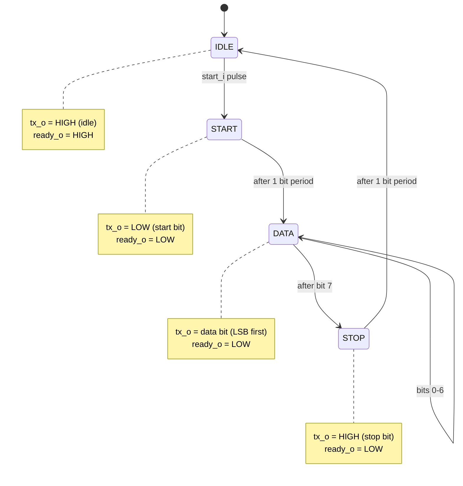
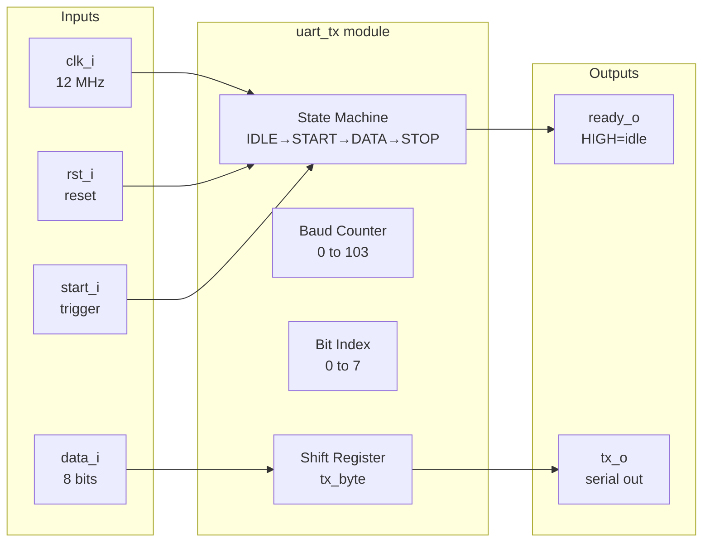
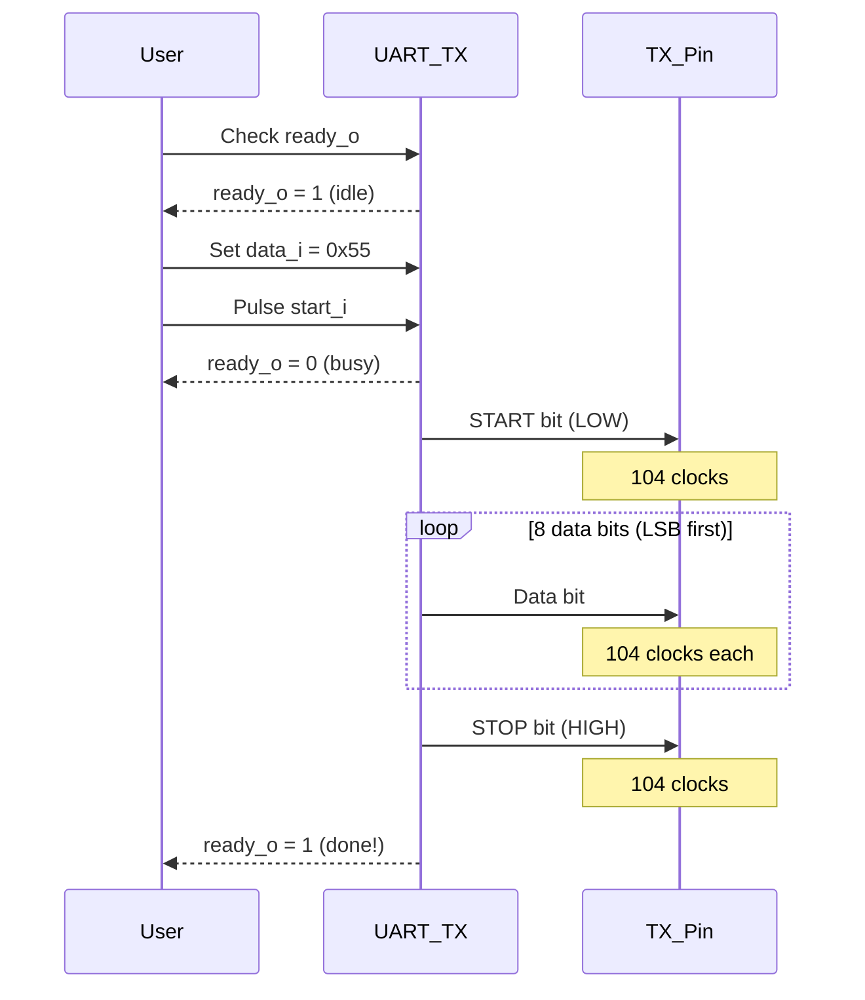

# UART TX - How It Works

## State Machine



## UART Frame Format

```mermaid
gantt
    title UART 8N1 Frame (115200 baud = ~8.68µs per bit)
    dateFormat X
    axisFormat %s

    section TX Line
    IDLE (HIGH)     :done, 0, 1
    START BIT (LOW) :active, 1, 2
    D0 (LSB)        :3, 3
    D1              :3, 4
    D2              :4, 5
    D3              :5, 6
    D4              :6, 7
    D5              :7, 8
    D6              :8, 9
    D7 (MSB)        :9, 10
    STOP BIT (HIGH) :done, 10, 11
    IDLE (HIGH)     :done, 11, 12
```



## Timing Diagram

```
                    1 bit period = 104 clocks @ 12MHz
                    |<--------->|

    IDLE    START      D0   D1   D2   D3   D4   D5   D6   D7   STOP   IDLE
            ┌────┐
    tx_o ───┘    └────┬────┬────┬────┬────┬────┬────┬────┬────┬────┬───────
            LOW       │    │    │    │    │    │    │    │HIGH│
                     LSB ─────────────────────────────> MSB

    ready_o ──┐                                                  ┌─────────
              └──────────────────────────────────────────────────┘

    start_i ──┐
              └┐ (single clock pulse)
               └──────────────────────────────────────────────────────────
```

## Signal Flow



## How to Send a Byte



## Example: Sending 0x55 (binary 01010101)

```
Byte: 0x55 = 0b01010101

Transmitted LSB first:
  D0=1, D1=0, D2=1, D3=0, D4=1, D5=0, D6=1, D7=0

TX Line:
         START  D0   D1   D2   D3   D4   D5   D6   D7  STOP
    HIGH ─┐     ┌───┐    ┌───┐    ┌───┐    ┌───┐    ┌──────
          └─────┘   └────┘   └────┘   └────┘   └────┘
         LOW   1    0    1    0    1    0    1    0   HIGH
```

## Key Parameters

| Parameter | Default | Description |
|-----------|---------|-------------|
| `CLOCKS_PER_BIT` | 104 | Clock cycles per bit period |

**Baud rate calculation:**
```
CLOCKS_PER_BIT = System_Clock / Baud_Rate
104 = 12,000,000 / 115,200
```

**Common values @ 12 MHz:**
| Baud Rate | CLOCKS_PER_BIT |
|-----------|----------------|
| 9600 | 1250 |
| 19200 | 625 |
| 38400 | 313 |
| 57600 | 208 |
| 115200 | 104 |
